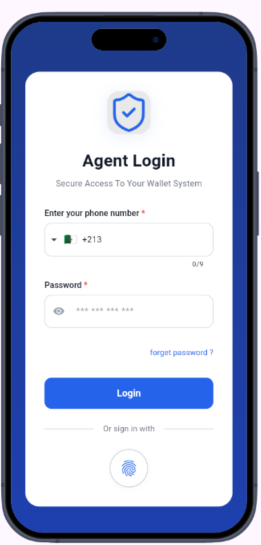
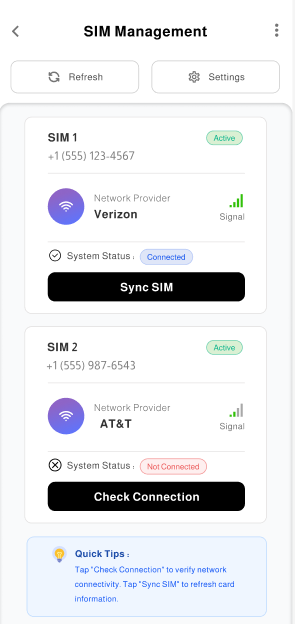
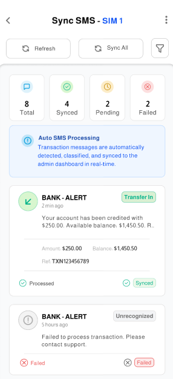

# 📱 SIM Management & Secure Authentication App (Flutter)

A professional Flutter application that demonstrates how to **read SIM card information**, **authenticate users via mobile number or biometrics**, and **display bank SMS messages** securely on Android devices.

---
## 📸 Images
<div align="center">
  <table>
    <tr>
      <td align="center">
        
        <br><b>SignIn</b>
      </td>    
      <td align="center">
        
        <br><b>All SIMs</b>
      </td>
      <td align="center">
        
        <br><b>SIM Details</b>
      </td>
    </tr>   
  </table>
</div>

---

## 🚀 Features

### 📡 SIM Card Management
- Detect **single & dual SIM cards**
- Read SIM information:
  - Carrier name
  - SIM slot index
  - Country / Network info (MCC / MNC)
- **Real-time SIM state detection** (insert / remove SIM while app is running)

---

### 🔐 Authentication
- **Mobile number authentication** (OTP-based flow)
- **Biometric login**:
  - Fingerprint
  - Face ID (supported devices)
- Secure session handling

---

### 💬 Bank SMS Reader
- Read **bank-related SMS messages** from inbox
- Filter messages by:
  - Sender
  - Keywords (e.g. OTP, transaction, balance)
- Display messages in a clean, readable UI

> ⚠️ SMS access is Android-only and follows Google Play privacy policies.

---

## 🏗 Architecture

This project follows **Clean Architecture** principles:
 ```
 lib/
  ├── core/
  │ ├── platform/ # Native channels (SIM / SMS / Biometrics)
  │ ├── utils/
  │ └── errors/
  │
  ├── features/
  │ ├── auth/
  │ │ ├── data/
  │ │ ├── domain/
  │ │ └── presentation/
  │ │
  │ ├── sim_management/
  │ │ ├── data/
  │ │ ├── domain/
  │ │ └── presentation/
```
---

---

## 🧩 Technologies & Packages

- **Flutter**
- **sim_reader** – Read SIM card information
- **permission_handler** – Runtime permissions
- **local_auth** – Biometric authentication
- **telephony / sms_advanced** – Read SMS messages
- **Bloc / Cubit** – State management
- **GoRouter** – Navigation
- **Clean Architecture** – Scalable project structure

---

## 📱 Platform Support

| Platform | Status |
|--------|-------|
| Android | ✅ Fully supported |
| iOS | ❌ Limited (SIM & SMS restricted by OS) |
| Web | ❌ Not supported |

---

## 🔑 Permissions (Android)

```xml
<uses-permission android:name="android.permission.READ_PHONE_STATE"/>
<uses-permission android:name="android.permission.READ_SMS"/>
<uses-permission android:name="android.permission.RECEIVE_SMS"/>
<uses-permission android:name="android.permission.USE_BIOMETRIC"/>

```
### Developed by Amr Ali 🚀
[GitHub](https://github.com/Amr-3li) | [LinkedIn](https://www.linkedin.com/in/amr-ali1/)
